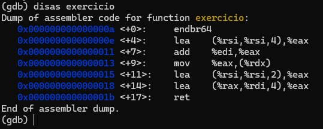

# GDB

### Como rodar o executável

gdb ./corretor

### Acessar valores de memória

---

info variables (consegue ver o que está guardado na ram relacionado a um arquivo, variaveis globais)

info functions mostra as variaveis de uma funcao

info registers (depois de rodar a funcao mostra valores atualizados) (procura o registrador que ele pedir)

### Ver valor da variável

---

x /s endereço(acessa o valor da string guardada no endereço)  

x /d endereco(acessa o valor do decimal)

### Ver o código de uma função

---

disas funcao (acessa o codigo (assembly) de uma funcao)

break funcao  (cria um breakpoint)

run (vai breakpoint comeca a rodar a funcao)

disas de novo pra ver onde esta e valores do registradores são atualizados pro inicio da função

caso queira avançar na função pode usar stepi ou ni vai pra prox linha (ex : quer o valor do registrador em uma linha especifica)

caso queira rodar a função toda (ex : quer ver o valor q a função retorna) pode so rodar finish

### Escrever valores

set $registrador = valor

set var x = valor

set * (tipo*)0xendereco = valor, tipo pode ser int, char, float.

set { int[3] } 0xendereco = { 1, 2, 3}

## Importante

registradores 64 bits quando começar com R e 32 bits quando começar com E.

1 byte = 8 bits

Eax / Rax é variavel de retorno

# Assembly pra C

Seguir a ordem dos registradores : 

lea  (valor1, valor2 , valor3) %reg : registrador = valor1 + (valor2 * valor 3) (reg = esse valor).

mov aponta o valor pra um outro registrador

quando aparecer entre parenteses (%rdx) é um ponteiro

quando for fazer a tradução de um registrador exx o tipo será int (32 bits)

quando for fazer a tradução de um registrador rxx o tipo será long (64 bits)

obs : shorts (16 bits)

mul -> sem sinal

imul -> com sinal

push caso use alguma variável antes (global) para usar dentro da função de um push

pop para retornar o valor original pra pilha

call chama outra função

ponteiro vai ser int no codigo c, caso o return seja int tambem (eax) pq int -> int

sil -> recebe apenas os 8 primeiros bits de rsi

a hierarquia importa se aparece exx e rxx importa o rxx vai ser long

### Exemplo simples :

### Condicional

*Comparações* : 

cmp = v2 - v1

if set : al = 1

*Exercicio comp* :

### Loops

cqto = pula

idiv : rax = quociente da divisao e rdx = resto

test : and bit a bit (& em c)

